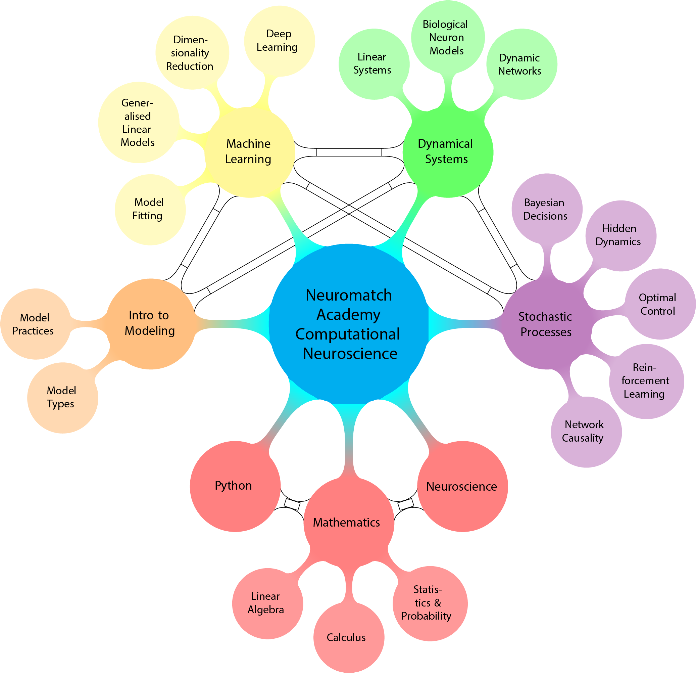
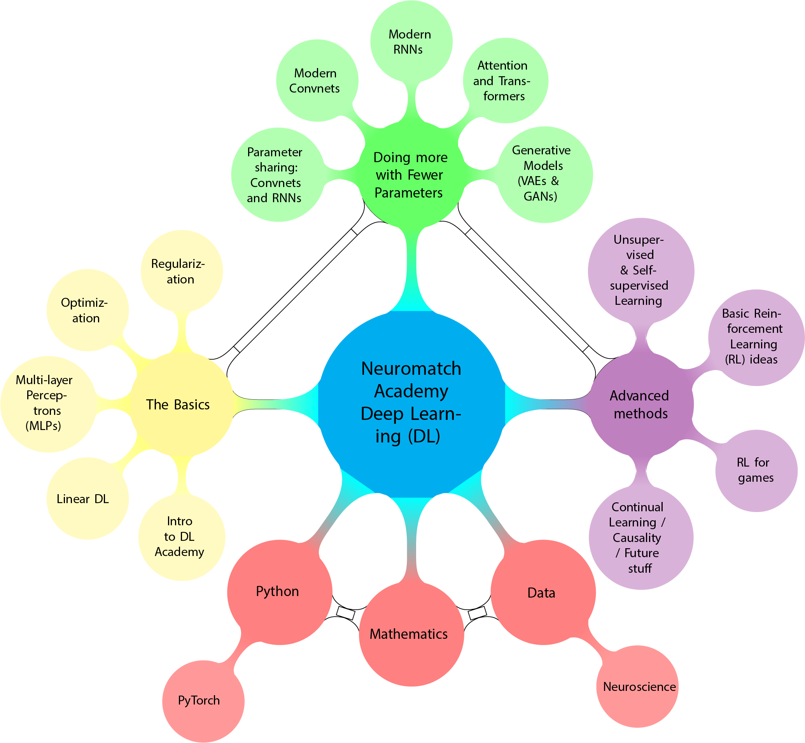
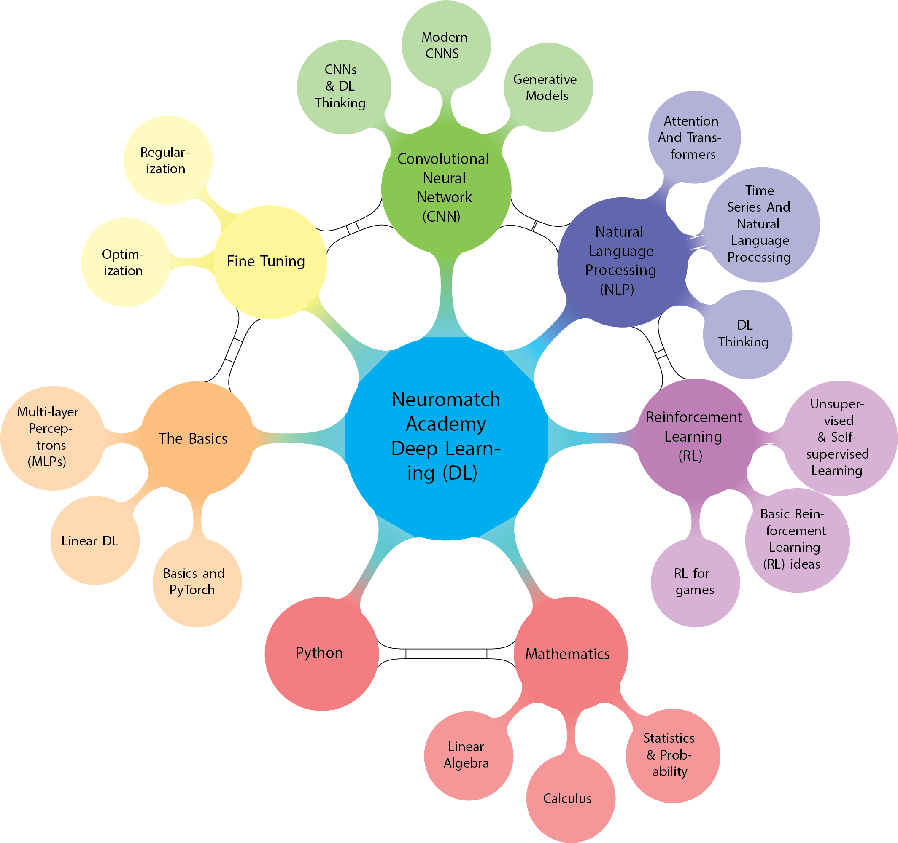

# Neuromatch Academy Concept Maps
This is a very small repository of LaTeX code to generate the Neuromatch Academy Curriculum Concept Maps.
To generate the concepts map I used the tikz package and the colours were chosen by my 7 year old daughter.

## Computational Neuroscience Neuromatch Concept Map

## Deep Learning Neuromatch Concept Map 2021

## Deep Learning Neuromatch Concept Map 2023

     
If you do use the code please cite:

't Hart, M. et al., (2022). Neuromatch Academy: a 3-week, online summer school in computational neuroscience. Journal of Open Source Education, 5(49), 118, https://doi.org/10.21105/jose.00118
